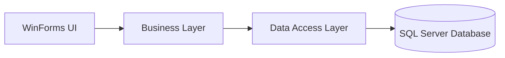
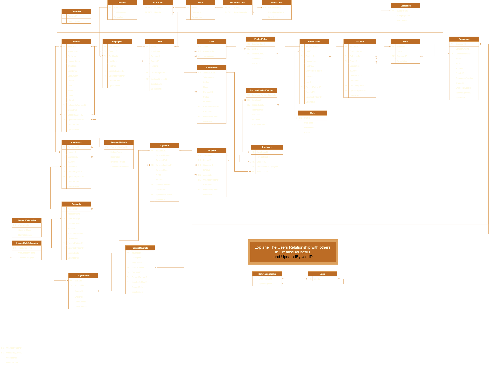

# Retail Management System (RMS)

A modern desktop Retail Management System built with C#, WinForms, and SQL Server to run day-to-day grocery and retail operations in one place.

## Overview Video

Watch the full system walkthrough:

[](https://youtu.be/OehyI2WHTDw)

Click the preview image to open the full video on YouTube.

## From Simple Grocery Project to RMS

I started this project as a small grocery management idea: keep products organized, avoid manual mistakes, and make daily work easier. At the beginning, it was mostly about storing records and keeping the interface simple enough to use quickly.

As soon as I moved from static records to real checkout flow, the project changed direction. A real store does not wait: products must be searchable, carts must move fast, payments must be trackable, and the interface must stay clear under pressure. That moment transformed the project from a basic app into a system.

The next leap was feature growth around inventory control. Product management expanded into categories, brands, units, and reorder levels. Instead of a flat list, it became a decision surface that helps the business know what to buy, when to restock, and how to keep catalog quality high.

After that, I added supplier and purchasing workflows because retail is not only about selling, it is also about procurement discipline. Then I introduced stronger operational controls, including permission keys and settings modules, so the system could scale from single-user use into role-based team usage.

Today, RMS reflects that journey: from a simple grocery project to a layered retail platform that handles POS, inventory, purchasing, and secure operations in one integrated solution.

## Feature Growth Journey (Visual)

### 1. Secure Entry Point


The journey starts with controlled access and an identity-first workflow.

### 2. Live POS Operations


The system evolves from record-keeping to real-time selling, cart handling, and payment flow.

### 3. Inventory and Product Governance


Feature growth introduces stronger product structure: search, filtering, category control, and reorder tracking.

### 4. Supplier and Purchase Lifecycle


Operations expand upstream to supplier relationships and purchase-side management.

### 5. Operational Control Center


The platform matures with configurable settings and broader administrative capabilities.

### 6. Theme Support (Light and Dark)


RMS supports both light mode and dark mode, allowing users to choose the visual style that fits their working environment.

## Core Capabilities

- POS workflow with product search, cart management, and sale completion.
- Fast pagination and filtering across major listing pages for quick daily operations.
- Product management with category, brand, and inventory-oriented controls.
- Supplier and purchase management for procurement workflows.
- Payment and allocation concepts for better transaction visibility.
- Role-oriented security design via centralized permission keys.
- Supports both light mode and dark mode for user comfort and readability.
- Layered architecture for maintainability and future feature expansion.

## Architecture

RMS follows a layered design:

- UI layer: WinForms pages, dialogs, and controls in `RMS_UI`.
- Business layer: domain entities and rules in `RMS_Business`.
- Data access layer: SQL interaction in `RMS_DataAccess`.
- Database layer: DDL, queries, and seed scripts under SQL resources.



## Technology Stack

- .NET 9
- C#
- WinForms
- SQL Server
- Microsoft.Data.SqlClient
- Syncfusion WinForms components

## Project Structure

```text
RMS/
	RMS_UI/          # Presentation layer (WinForms)
	RMS_Business/    # Business/domain layer
	RMS_DataAccess/  # Data access layer
SQL Queries/       # SQL scripts and module-level queries
```

## Getting Started

### 1. Prerequisites

- .NET SDK 9.0+
- SQL Server instance
- Visual Studio 2022+ (recommended for WinForms development)

### 2. Database Setup

1. Execute `The Final DDL RMS Database Structuresql.sql` to create schema.
2. Run required module scripts from `SQL Queries/` as needed.

### 3. Configure Connection String

Update the connection string in:

- `RMS/RMS_DataAccess/clsDataAccessSettings.cs`

Default currently points to:

```csharp
Server=. ;Database= RMS ;User Id= sa ;Password= sa123456; TrustServerCertificate=True;
```

### 4. Run the Application

1. Open `RMS/RMS.sln`.
2. Set `RMS_UI` as startup project.
3. Build and run.
4. Sign in from the login form to open the main RMS shell.

## Security and Permissions

Permission keys are centralized in:

- `RMS/RMS_Business/clsPermissionKeys.cs`

This supports consistent role-based authorization and avoids scattered hardcoded permission strings.

## View Database and ERD

### ERD Preview



### Database Scripts and Model Files

- Main DDL script: [The Final DDL RMS Database Structuresql.sql](The%20Final%20DDL%20RMS%20Database%20Structuresql.sql)
- SQL query modules: [SQL Queries](SQL%20Queries/)
- ERD image: [RelationalModel.png](RelationalModel.png)
- ERD editable file: [RelationalModel.drawio](RelationalModel.drawio)
- ERD HTML view: [RelationalModel.html](RelationalModel.html)

## Project Status

This project is still in progress and not finished yet.
New features, refinements, and stability improvements are actively being added.

## Roadmap

- Add CI pipeline and quality badges.
- Add packaged demo dataset and onboarding script.
- Expand reporting and analytics modules.
- Add release notes and versioned changelog.

## Author Note

This project represents an engineering journey: starting small, learning from real retail workflows, and iterating into a structured RMS platform with stronger architecture and richer features over time.
